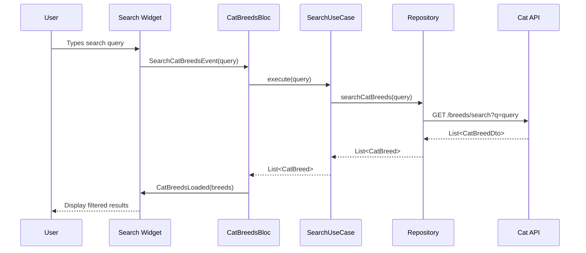
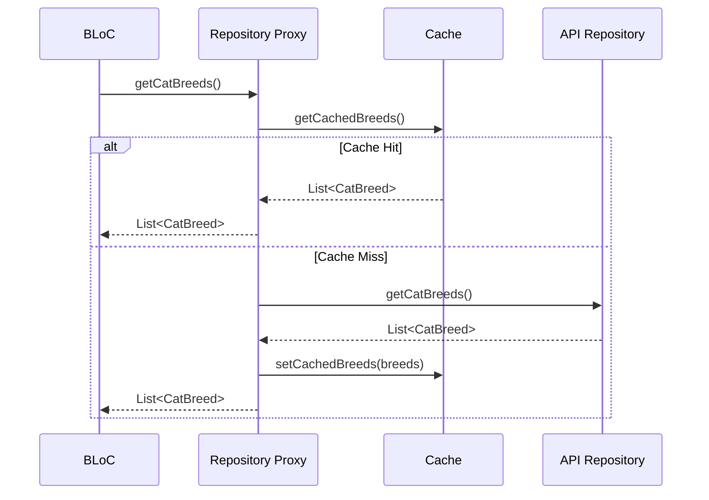

# Architecture Documentation

This document describes the architecture, package layout, libraries, design patterns, testing strategy, CI expectations, and how the implementation maps to the original technical challenge.

## Table of Contents

- [Overview](#overview)
- [Project Package Layout](#project-package-layout)
- [Clean Architecture Principles](#clean-architecture-principles)
- [Layer Structure](#layer-structure)
- [Data Flow](#data-flow)
- [Design Patterns](#design-patterns)
- [Dependency Injection](#dependency-injection)
- [State Management](#state-management)
- [Testing Strategy](#testing-strategy)
- [Performance Considerations](#performance-considerations)
- [Future Improvements](#future-improvements)

## Overview

The Cat Breeds application follows **Clean Architecture** principles as defined by Robert C. Martin, ensuring separation of concerns, testability, and maintainability. The architecture is designed to be:

- **Independent of Frameworks**: Business logic doesn't depend on Flutter or external libraries
- **Testable**: Each layer can be tested in isolation
- **Independent of UI**: UI can change without affecting business logic
- **Independent of Database**: Data sources can be swapped without affecting business rules
- **Independent of External Agencies**: Business rules don't know about external interfaces

## Project Package Layout 📁

```
pragma_cat_breeds/
├── lib/
│   ├── main.dart                    # Application entry point
│   └── src/
│       ├── dependency_injection/   # DI setup
│       └── presentation/           # UI components
│           ├── cat_breeds/         # Cat breeds feature
│           │   ├── bloc/           # State management
│           │   ├── pages/          # Screen widgets
│           │   └── widgets/        # Reusable UI components
│           └── cat_breed_detail/   # Breed detail feature
├── module/
│   ├── domain/                     # Business logic
│   │   ├── lib/
│   │   │   └── src/cat_breed/     # Cat breed domain
│   │   └── pubspec.yaml
│   └── infrastructure/            # Data layer
│       ├── lib/
│       │   └── src/cat_breed/     # Cat breed data sources
│       └── pubspec.yaml
├── test/                          # Test files
├── scripts/                       # Development scripts
└── docs/                         # Documentation
```

## Clean Architecture Principles

### Dependency Rule

Dependencies only point inward. Source code dependencies can only point toward higher-level policies:

```
Presentation Layer → Domain Layer ← Infrastructure Layer
```

### Layer Independence

Each layer has specific responsibilities and doesn't know about the implementation details of other layers.

## Layer Structure

### 1. Domain Layer (`module/domain/`)

The **core** of the application containing business logic and entities.

```
module/domain/lib/src/cat_breed/
├── entity/
│   └── cat_breed.dart           # Core business entity
├── repository/
│   └── cat_breed_repository.dart # Repository interface
└── use_case/
    ├── get_cat_breeds_use_case.dart
    └── search_cat_breeds_use_case.dart
```

#### Responsibilities:
- Define business entities (`CatBreed`)
- Define repository interfaces
- Implement business use cases
- Enforce business rules

#### Key Components:

**CatBreed Entity:**
```dart
class CatBreed {
  final String id;
  final String name;
  final String description;
  final String temperament;
  final String origin;
  final int energyLevel;
  final int affectionLevel;
  // ... other properties
}
```

**Repository Interface:**
```dart
abstract class CatBreedRepository {
  Future<List<CatBreed>> getCatBreeds();
  Future<List<CatBreed>> searchCatBreeds(String query);
}
```

**Use Cases:**
- `GetCatBreedsUseCase`: Simple delegation to repository to retrieve all cat breeds
- `SearchCatBreedsUseCase`: Pure pass-through to repository search functionality

### 2. Infrastructure Layer (`module/infrastructure/`)

Handles external dependencies and data sources. **Recently optimized for better separation of concerns and cleaner architecture.**

```
module/infrastructure/lib/src/cat_breed/
├── cat_breed_repository_proxy.dart # Main entry point - Repository proxy with caching
├── api/                         # API-related components
│   ├── cat_breed_api.dart           # HTTP API client (simplified exception handling)
│   ├── cat_breed_repository_api.dart # Repository implementation for API
│   └── network/                     # Network utilities and DTOs
│       ├── dto/                     # Pure Data Transfer Objects
│       │   ├── cat_breed_dto.dart       # Pure DTO without logic
│       │   └── cat_breed_image_dto.dart # Pure DTO without logic
│       ├── translator/
│       │   └── cat_breed_translator.dart # JSON serialization + DTO to Entity translation
│       └── dio_retry_interceptor.dart    # HTTP retry logic
├── cache/                       # Cache-related components
│   └── cat_breed_cache.dart         # In-memory caching
└── dependency_injection/
    └── infrastructure_module.dart    # DI configuration with injectable
```

#### Recent Optimizations:

1. **Pure DTOs**: Removed business logic from DTOs, moved to translator
2. **Exception Transparency**: Removed exception wrapping to let them bubble up naturally
3. **Better Organization**: Grouped API and cache components into separate folders
4. **Cleaner Dependencies**: API client now properly receives translator via DI

#### Responsibilities:
- Implement repository interfaces
- Handle HTTP requests and responses with transparent exception propagation
- Manage data caching with proxy pattern
- Transform JSON data to DTOs and domain entities
- Handle network errors and retries

#### Key Components:

**API Client (Simplified):**
```dart
class CatBreedApi {
  // No try-catch wrapping - exceptions propagate naturally
  Future<List<CatBreedDto>> getCatBreeds() async {
    final response = await _dio.get<List<dynamic>>('/breeds');
    return _translator.fromJsonList(response.data!);
  }
}
```

**Pure DTOs:**
```dart
// Pure data class without JSON logic
class CatBreedDto {
  const CatBreedDto({this.id, this.name, ...});
  
  final String? id;
  final String? name;
  // No fromJson/toJson methods - handled by translator
}
```

**Translator with All Logic:**
```dart
class CatBreedTranslator {
  // Handles JSON serialization/deserialization
  CatBreedDto fromJson(Map<String, dynamic> json);
  List<CatBreedDto> fromJsonList(List<dynamic> jsonList);
  
  // Handles DTO to domain entity conversion
  CatBreed fromDto(CatBreedDto dto);
  List<CatBreed> fromDtoList(List<CatBreedDto> dtos);
}
```

**Caching Strategy:**
- **TTL**: 5-minute cache expiration
- **Strategy**: Cache-first with background refresh
- **Storage**: In-memory cache with LRU eviction

**Repository Implementation:**
```dart
class CatBreedRepositoryProxy implements CatBreedRepository {
  // Combines API and cache for optimal performance
  // Clean exception propagation without wrapping
}
```

### 3. Presentation Layer (`lib/src/presentation/`)

Handles UI and user interactions.

```
lib/src/presentation/
├── cat_breeds/
│   ├── bloc/                    # State management
│   │   ├── cat_breeds_bloc.dart
│   │   ├── cat_breeds_event.dart
│   │   └── cat_breeds_state.dart
│   ├── page/
│   │   └── cat_breeds_page.dart # Main list screen
│   └── widgets/
│       ├── cat_breed_list_item.dart
│       ├── cat_breeds_list.dart
│       └── cat_breeds_search_bar.dart
└── cat_breed_detail/
    ├── page/
    │   └── cat_breed_detail_page.dart
    └── widgets/
        └── breed_characteristics_widget.dart
```

#### Responsibilities:
- Display data to users
- Handle user interactions
- Manage UI state
- Navigate between screens

## Data Flow

### 1. User Interaction Flow

```
User Input → BLoC Event → Use Case → Repository → API/Cache → Domain Entity → BLoC State → UI Update
```

### 2. Search Flow Example



### 3. Caching Flow



## Recent Architecture Optimizations

The infrastructure layer underwent significant improvements to follow clean architecture principles more strictly and improve maintainability:

### 1. DTO Purification
**Before**: DTOs contained business logic and JSON serialization methods
```dart
class CatBreedDto {
  factory CatBreedDto.fromJson(Map<String, dynamic> json) { ... }
  Map<String, dynamic> toJson() { ... }
  static bool? _parseRare(dynamic value) { ... } // Business logic in DTO
}
```

**After**: Pure data classes following the DTO pattern
```dart
class CatBreedDto {
  const CatBreedDto({this.id, this.name, ...});
  final String? id;
  final String? name;
  // No methods - pure data transfer object
}
```

### 2. Translator Responsibility Expansion
**Enhancement**: Moved all serialization and parsing logic to the translator
```dart
class CatBreedTranslator {
  // JSON handling (moved from DTOs)
  CatBreedDto fromJson(Map<String, dynamic> json);
  List<CatBreedDto> fromJsonList(List<dynamic> jsonList);
  
  // Domain conversion (existing)
  CatBreed fromDto(CatBreedDto dto);
  List<CatBreed> fromDtoList(List<CatBreedDto> dtos);
  
  // Special parsing logic (moved from DTOs)
  static bool? _parseRare(dynamic value);
}
```

### 3. Exception Transparency
**Before**: API and repository layers wrapped exceptions
```dart
Future<List<CatBreed>> getCatBreeds() async {
  try {
    final dtos = await _api.getCatBreeds();
    return _translator.fromDtoList(dtos);
  } catch (e) {
    throw Exception('Failed to fetch cat breeds: $e'); // Wrapping
  }
}
```

**After**: Clean exception propagation
```dart
Future<List<CatBreed>> getCatBreeds() async {
  final dtos = await _api.getCatBreeds();
  return _translator.fromDtoList(dtos);
  // Let exceptions bubble up naturally
}
```

### 4. Improved Organization
**New Structure**: Better separation of concerns
```
src/cat_breed/
├── cat_breed_repository_proxy.dart # Main entry point (moved to root for better visibility)
├── api/           # All API-related components
│   ├── network/   # DTOs, translators, interceptors
│   └── *.dart     # API clients and repositories
└── cache/         # Cache utilities only
```

### 5. Repository Proxy as Entry Point
**Enhancement**: Moved CatBreedRepositoryProxy to root level
- **Reason**: As the main entry point to the infrastructure layer, it deserves prominent placement
- **Benefit**: Better discoverability and clearer architecture intention
- **Pattern**: Entry point components at module root, supporting components in subfolders

### 6. Dependency Injection Enhancement
**Improvement**: API client now properly receives dependencies
```dart
@lazySingleton
CatBreedApi catBreedApi(Dio dio, CatBreedTranslator translator) => 
    CatBreedApi(dio, translator);
```

**Benefits of These Optimizations:**
- **Cleaner Code**: Pure DTOs and focused responsibilities
- **Better Testability**: Clear separation makes mocking easier
- **Exception Clarity**: Natural error propagation for better debugging
- **Maintainability**: Organized structure and single responsibility
- **DI Best Practices**: Proper dependency injection throughout

## Design Patterns

### 1. Repository Pattern
- Abstracts data access logic
- Allows switching between data sources
- Enables easy testing with mock repositories

### 2. Use Case Pattern
- Encapsulates business logic
- Single responsibility principle
- Testable business rules

### 3. BLoC Pattern
- Separates business logic from UI
- Reactive programming with streams
- Predictable state management

### 4. Dependency Injection
- Loose coupling between components
- Easy testing and mocking
- Service locator pattern with GetIt

### 5. Proxy Pattern
- Repository proxy for caching
- Transparent cache management
- Performance optimization

## Dependency Injection

### Modern Micro-Package Architecture

The application now uses **Injectable** with a micro-package pattern for automatic dependency injection and code generation:

#### Main Application DI Setup

```dart
@InjectableInit(
  externalPackageModulesAfter: [
    ExternalModule(InfrastructurePackageModule),
  ],
)
Future<void> configureDependencies() => getIt.init();
```

#### Infrastructure Micro-Package

The infrastructure module is configured as a self-contained micro-package:

```dart
@InjectableInit(
  initializerName: 'initInfrastructureModule',
  preferRelativeImports: false,
  asExtension: false,
  generateForDir: ['lib'],
  usesNullSafety: true,
)
@MicroPackageModule()
abstract class InfrastructureModule {
  // Module definitions...
}

@InjectableInit.microPackage()
void initInfrastructure() {}
```

#### Auto-Generated Dependencies

The code generator creates all dependency registrations automatically:

```dart
// Auto-generated infrastructure.module.dart
class InfrastructurePackageModule extends MicroPackageModule {
  @override
  Future<void> init(GetItHelper gh) async {
    final infrastructureModule = _$InfrastructureModule();
    
    // All dependencies registered automatically
    gh.lazySingleton<DioRetryInterceptor>(() => infrastructureModule.dioRetryInterceptor());
    gh.lazySingleton<CatBreedTranslator>(() => infrastructureModule.catBreedTranslator());
    gh.lazySingleton<CatBreedCache>(() => infrastructureModule.catBreedCache());
    
    await gh.lazySingletonAsync<Dio>(
      () => infrastructureModule.dio(gh<DioRetryInterceptor>()),
      preResolve: true,
    );
    
    // Complete dependency chain auto-wired
    gh.lazySingleton<CatBreedRepository>(() => infrastructureModule.catBreedRepository(
      gh<CatBreedRepositoryApi>(), gh<CatBreedCache>()));
  }
}
```

#### Benefits of Micro-Package Pattern

1. **Code Generation**: All dependency registration is automatic
2. **Type Safety**: Compile-time validation of dependencies  
3. **Modularity**: Clear separation between infrastructure and presentation
4. **Maintainability**: No manual dependency registration code
5. **Scalability**: Easy to add new micro-packages for features

### 📖 Detailed Documentation

For comprehensive examples and implementation details:

- **[Dependency Injection Examples](module/infrastructure/DEPENDENCY_INJECTION_EXAMPLES.md)**: Complete examples of micro-package pattern implementation with before/after comparisons and testing strategies
- **[Infrastructure Implementation](module/infrastructure/INFRASTRUCTURE_IMPLEMENTATION.md)**: Detailed documentation of the infrastructure layer design, patterns used, and architectural decisions

### Scope Management

- **@lazySingleton**: Repositories, API clients, caches, use cases
- **@injectable**: BLoCs (factory scope for fresh instances)
- **@preResolve**: Async dependencies like Dio configuration

### Dependency Resolution Order

1. **Infrastructure Micro-Package**: All data layer dependencies
2. **Presentation Layer**: BLoCs and UI components with auto-injection
3. **External Modules**: Additional micro-packages as needed

## State Management

### BLoC Architecture

```dart
// Events
abstract class CatBreedsEvent extends Equatable {}
class LoadCatBreedsEvent extends CatBreedsEvent {}
class SearchCatBreedsEvent extends CatBreedsEvent {
  final String query;
}

// States
sealed class CatBreedsState extends Equatable {}
class CatBreedsInitial extends CatBreedsState {}
class CatBreedsLoading extends CatBreedsState {}
class CatBreedsLoaded extends CatBreedsState {
  final List<CatBreed> breeds;
  final bool isSearching;
  final String searchQuery;
}
class CatBreedsError extends CatBreedsState {
  final String message;
}
```

### Search Debouncing

Implements debouncing to optimize API calls:

```dart
@override
Stream<CatBreedsState> mapEventToState(CatBreedsEvent event) async* {
  if (event is SearchCatBreedsEvent) {
    yield* _debounceSearch(event.query);
  }
}

Stream<CatBreedsState> _debounceSearch(String query) async* {
  // Cancel previous search
  _searchCancellable?.cancel();
  
  // Wait 300ms before searching
  _searchCancellable = Timer(Duration(milliseconds: 300), () {
    add(PerformSearchEvent(query));
  });
}
```

## Testing Strategy

The application follows a comprehensive testing strategy with **100% coverage** in the domain layer and robust testing patterns throughout all layers.

> 📚 **Detailed Testing Documentation**: 
> - [Test Organization Principles](test/TEST_ORGANIZATION.md) - **Essential guidelines for organizing tests and mocks across layers**
> - [Domain Tests Documentation](module/domain/test/README.md) - Comprehensive domain testing patterns and examples
> - [Domain Test Organization](module/domain/test/TEST_ORGANIZATION.md) - Clean Architecture compliance and business logic focus
> - [Infrastructure Tests Documentation](module/infrastructure/test/README.md) - Infrastructure testing strategies and coverage
> - [Infrastructure Test Organization](module/infrastructure/test/TEST_ORGANIZATION.md) - Common Closure Principle and test doubles organization

### 1. Unit Tests - Domain Layer

**Architecture & Coverage:**
```
module/domain/test/
├── src/cat_breed/
│   ├── entity/
│   │   ├── cat_breed_test.dart           # Entity tests (20 cases)
│   │   └── builders/
│   │       └── cat_breed_test_data_builder.dart
│   └── use_case/
│       ├── get_cat_breeds_use_case_test.dart        # GetUseCase tests (9 cases)
│       ├── search_cat_breeds_use_case_test.dart     # SearchUseCase tests (15 cases)
│       └── test_doubles/
│           └── mock_cat_breed_repository.dart
└── README.md                             # Comprehensive testing documentation
```

### 2. Unit Tests - Infrastructure Layer

**Architecture & Coverage:**
```
module/infrastructure/test/
├── src/cat_breed/
│   ├── api/
│   │   ├── cat_breed_api_test.dart                    # API tests (23 cases)
│   │   └── network/
│   │       ├── dto/
│   │       │   ├── builders/                          # Test data builders
│   │       │   ├── cat_breed_dto_test.dart            # DTO tests (11 cases)
│   │       │   └── cat_breed_image_dto_test.dart      # Image DTO tests (19 cases)
│   │       └── translator/
│   │           └── cat_breed_translator_test.dart     # Translation tests (36 cases)
│   ├── cache/
│   │   ├── cache_entry_test.dart                      # TTL tests (17 cases)
│   │   └── cat_breed_cache_test.dart                  # Cache tests (36 cases)
│   └── cat_breed_repository_proxy_test.dart          # Proxy tests (22 cases)
└── docs/
    └── TESTING.md                                     # Infrastructure testing documentation
```

**Total Infrastructure Coverage: 163 tests**

**Key Testing Patterns:**

#### Triple A Pattern (Arrange-Act-Assert)
```dart
test('repositoryReturnsBreeds | successfulCall | returnsListOfBreeds', () async {
  // Arrange
  final expectedBreeds = [CatBreedTestDataBuilder().withId('persian').build()];
  when(() => mockRepository.getCatBreeds()).thenAnswer((_) async => expectedBreeds);

  // Act
  final result = await useCase.call();

  // Assert
  expect(result, equals(expectedBreeds));
  verify(() => mockRepository.getCatBreeds()).called(1);
});
```

#### Test Data Builder Pattern
```dart
final catBreed = CatBreedTestDataBuilder()
    .withId('custom_id')
    .withName('Custom Breed')
    .withEnergyLevel(5)
    .build();

// Pre-configured builders
final persian = CatBreedTestDataBuilder.persian().build();
final minimal = CatBreedTestDataBuilder.minimal().build();
```

#### Mocktail Integration
```dart
class MockCatBreedRepository extends Mock implements CatBreedRepository {}

// Usage
when(() => mockRepository.getCatBreeds()).thenAnswer((_) async => breeds);
verify(() => mockRepository.searchCatBreeds(query)).called(1);
```

**Domain Coverage Summary:**
- **Total**: 37 test cases achieving 100% code coverage
- **CatBreed Entity**: 20 cases (constructor, builder, properties)
- **GetCatBreedsUseCase**: 9 cases (success, error, constructor)
- **SearchCatBreedsUseCase**: 15 cases (queries, errors, behavior)
- **Execution**: < 3 seconds, purely isolated unit tests

### 2. Integration Tests - Infrastructure Layer
```dart
group('CatBreedRepositoryProxy', () {
  test('should return cached data when available', () async {
    // Test caching behavior
  });
  
  test('should fetch from API when cache expired', () async {
    // Test cache expiration
  });
});
```

### 2. Widget Tests

```dart
testWidgets('CatBreedsList should display breeds', (tester) async {
  // Arrange
  final mockBloc = MockCatBreedsBloc();
  when(() => mockBloc.state).thenReturn(CatBreedsLoaded(breeds: testBreeds));
  
  // Act
  await tester.pumpWidget(TestableWidget(
    child: BlocProvider.value(value: mockBloc, child: CatBreedsList()),
  ));
  
  // Assert
  expect(find.text('Persian'), findsOneWidget);
});
```

### 3. Integration Tests

```dart
group('Cat Breeds App Integration', () {
  test('should load cat breeds from API', () async {
    await configureDependencies();
    final useCase = getIt<GetCatBreedsUseCase>();
    
    final result = await useCase();
    
    expect(result.isNotEmpty, isTrue);
  });
});
```

### 4. BLoC Tests

```dart
blocTest<CatBreedsBloc, CatBreedsState>(
  'should emit loaded state when breeds are fetched successfully',
  build: () => CatBreedsBloc(mockGetUseCase, mockSearchUseCase),
  act: (bloc) => bloc.add(LoadCatBreedsEvent()),
  expect: () => [
    CatBreedsLoading(),
    CatBreedsLoaded(breeds: testBreeds),
  ],
);
```

## Performance Considerations

### 1. Caching Strategy

- **Local Cache**: In-memory with 5-minute TTL
- **Image Caching**: `cached_network_image` for efficient image loading
- **Search Debouncing**: 300ms delay to reduce API calls

### 2. Memory Management

- Proper disposal of BLoCs and streams
- Image cache size limits
- Lazy loading of breed details

### 3. Network Optimization

- HTTP retry mechanism with exponential backoff
- Request cancellation for outdated searches
- Compression support in HTTP client

### 4. UI Performance

- ListView.builder for efficient list rendering
- Hero animations for smooth transitions
- Placeholder widgets during loading

## Error Handling

### 1. Network Errors

```dart
try {
  final response = await dio.get('/breeds');
  return response.data;
} on DioException catch (e) {
  if (e.type == DioExceptionType.connectTimeout) {
    throw NetworkException('Connection timeout');
  }
  throw NetworkException('Network error: ${e.message}');
}
```

### 2. Business Logic Errors

```dart
// Use cases are now simplified - pure delegation to repository
Future<List<CatBreed>> call() async {
  return await _repository.getCatBreeds();
}

// Error handling is done at the presentation layer (BLoC)
// This follows Clean Architecture principles where domain 
// layer contains pure business logic without error handling
```

### 3. UI Error States

```dart
Widget build(BuildContext context) {
  return BlocBuilder<CatBreedsBloc, CatBreedsState>(
    builder: (context, state) {
      return switch (state) {
        CatBreedsError() => ErrorWidget(
          message: state.message,
          onRetry: () => context.read<CatBreedsBloc>().add(LoadCatBreedsEvent()),
        ),
        // ... other states
      };
    },
  );
}
```

## Security Considerations

### 1. API Security

- HTTPS-only communication
- No API keys stored in client (public API)
- Request/response validation

### 2. Data Validation

- Input sanitization for search queries
- DTO validation before entity conversion
- Null safety throughout the codebase

## Scalability

### 1. Modular Architecture

Each feature can be developed independently:
- Domain modules can be extracted to separate packages
- Infrastructure can be swapped without affecting business logic
- New features follow the same architectural patterns

### 2. Code Generation

Ready for code generation tools:
- Injectable for dependency injection
- Freezed for immutable classes
- Json_annotation for serialization

### 3. Multi-platform Support

Architecture supports multiple platforms:
- Shared business logic across platforms
- Platform-specific UI implementations
- Platform-specific data sources

## Future Improvements

### 1. Offline Support

- Local database (SQLite/Hive) for persistent caching
- Sync mechanism for data updates
- Offline-first architecture

### 2. Performance Enhancements

- Pagination for large breed lists
- Image preloading and optimization
- Background data refresh

### 3. Feature Additions

- Favorites system
- Breed comparison
- Advanced filtering options
- User preferences

### 4. Architecture Evolution

- Migration to code generation (Injectable, Freezed)
- GraphQL implementation
- Micro-frontend architecture for web

## Internationalization (i18n)

The application supports multiple languages through Flutter's internationalization framework:

### Configuration

The i18n system is configured via `l10n.yaml`:

```yaml
arb-dir: lib/l10n
template-arb-file: app_en.arb
output-localization-file: app_localizations.dart
```

### Supported Languages

- **English (en)**: Default language, defined in `app_en.arb`
- **Spanish (es)**: Secondary language, defined in `app_es.arb`

### ARB Files Structure

ARB (Application Resource Bundle) files contain translation keys with metadata:

```json
{
  "@@locale": "en",
  "appTitle": "Cat Breeds",
  "@appTitle": {
    "description": "The title of the application"
  },
  "searchHint": "Search cat breeds...",
  "@searchHint": {
    "description": "Placeholder text for the search input field"
  }
}
```

### Usage in Code

```dart
import 'package:pragma_cat_breeds/l10n/app_localizations.dart';

// In build method
final l10n = AppLocalizations.of(context)!;
Text(l10n.appTitle)
```

### Adding New Languages

1. Create new ARB file: `lib/l10n/app_{locale}.arb`
2. Add locale to `supportedLocales` in `main.dart`
3. Run `flutter gen-l10n` to generate localization files

### Text Formatting

For dynamic content, use placeholders in ARB files:

```json
{
  "noResultsFor": "No results for \"{query}\"",
  "@noResultsFor": {
    "description": "Message shown when no search results are found",
    "placeholders": {
      "query": {
        "type": "String"
      }
    }
  }
}
```

Usage in code:
```dart
Text(l10n.noResultsFor(searchQuery))
```

## Development Scripts and Tools 🛠️

The project includes two categories of scripts for different purposes:

### Developer Scripts (`scripts/`)

**Purpose**: Manual use by developers working locally  
**Audience**: Human developers  
**Characteristics**: User-friendly interface with colors, emojis, and detailed feedback

| Script | Purpose | Features |
|---------|---------|----------|
| `setup.sh` | Environment setup | Automatic Flutter/Dart verification, dependency installation |
| `test_coverage.sh/bat` | Coverage generation | HTML reports, visual feedback, browser opening |
| `performance_test.sh` | Performance testing | Detailed performance metrics and recommendations |

**Example Usage:**
```bash
# Setup development environment
./scripts/setup.sh

# Generate coverage with visual reports
./scripts/test_coverage.sh
```

### Automation Scripts (`tool/`)

**Purpose**: CI/CD and automated systems  
**Audience**: GitHub Actions, build systems  
**Characteristics**: Minimal output, structured data, specific exit codes

| Script | Purpose | Features |
|---------|---------|----------|
| `tool/ci/check_coverage.dart` | Coverage validation | Programmatic threshold checking, CI integration |
| `tool/ci/analyze_check.dart` | Code analysis | Automated quality checks, JSON parsing |

**Example Usage:**
```bash
# Check coverage threshold (used in CI)
dart run tool/ci/check_coverage.dart coverage.lcov 90

# Analyze code issues (used in CI)
dart run tool/ci/analyze_check.dart flutter_analyze_output.json
```

### Coverage Thresholds

Both script categories use **consistent coverage thresholds**:

- **Domain Layer**: 90% (business logic must be well-tested)
- **Infrastructure Layer**: 60% (data layer with external dependencies)
- **Presentation BLoC**: 50% (state management logic)
- **Presentation Widgets**: 40% (UI components with Flutter testing complexity)

These thresholds are enforced in:
- ✅ Developer scripts (`scripts/test_coverage.*`)
- ✅ CI pipeline (`.github/workflows/ci.yml`)
- ✅ Automation tools (`tool/ci/check_coverage.dart`)

## Related Documentation

📚 **Additional Technical Documentation:**
- [Presentation Layer Architecture](docs/PRESENTATION_ARCHITECTURE.md) - Detailed presentation layer patterns
- [Performance Optimization Guide](docs/PERFORMANCE.md) - Performance best practices and benchmarks
- [Contributing Guidelines](CONTRIBUTING.md) - Development workflow and standards
- [Change History](CHANGELOG.md) - Project evolution and updates

## Future Improvements
```

## Conclusion

The Cat Breeds application demonstrates a robust implementation of Clean Architecture principles in Flutter, providing:

- **Separation of Concerns**: Clear layer boundaries and responsibilities
- **Testability**: Each component can be tested in isolation
- **Maintainability**: Easy to modify and extend
- **Performance**: Efficient caching and network strategies
- **Scalability**: Ready for feature additions and platform expansion

The architecture serves as a solid foundation for enterprise-level Flutter applications, balancing complexity with maintainability while following industry best practices.